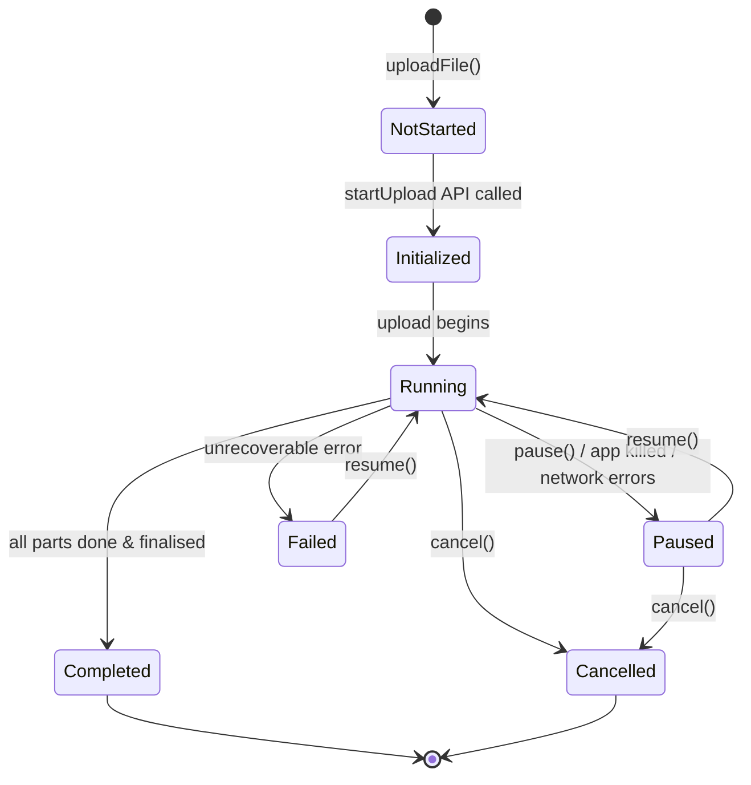
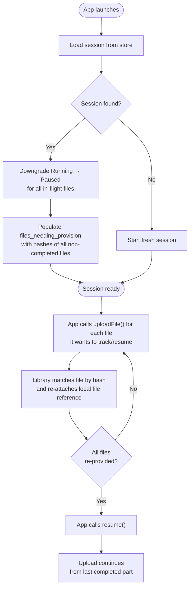

The library maintains a fully persistent upload session so that uploads survive app restarts,
crashes, and background process kills. All state is serialised to an embedded key-value store
([redb](https://github.com/cberner/redb) on iOS/Android, IndexedDB on the web) and
reloaded on the next launch.

## File upload states

Every file tracked by the library is in exactly one of these states:

| State | Description |
| --- | --- |
| `NotStarted` | Registered but upload not yet started (or reset after resume) |
| `Initialized` | `startUpload` backend endpoint called, multipart upload ID obtained |
| `Running` | Parts are actively being uploaded |
| `Paused` | Upload paused — by user, app kill, or too many network errors |
| `Completed` | All parts uploaded and multipart upload finalised |
| `Failed` | Unrecoverable error |
| `Cancelled` | Cancelled by the user |

The global session also tracks an aggregate state (`Running`, `RunningInBg`, `Paused`, `Completed`, `Failed`)
derived from all individual file states — this drives the system notification on iOS and Android.

## File hash

Every file is identified by a **Murmur3 128-bit hash** that is computed once when `uploadFile()` is called
and stored alongside the file entry. The hash is deterministic across app restarts and is used as the
primary key for deduplication and resume matching.

**Hash inputs:**
- The `transferId` — so the same file in different transfers produces a different hash
- Up to three file samples (first 16 KB, middle 16 KB, last 16 KB; or the whole file if < 128 KB)
- The file size encoded as a varint

Sampling instead of hashing the full file keeps the cost negligible even for multi-gigabyte files
while still being collision-resistant for practical use.

The session maintains an in-memory `hash → fileKey` index so dedup lookups are O(1).
When a file with the same hash is already `Completed`, `uploadFile()` returns the existing key immediately
without re-uploading. When the file is in a resumable state, the upload is continued rather than restarted.

## Session restoration after app restart

When the native process is killed (background eviction, crash, or normal app close)
the in-memory upload queue is gone, but the persisted session is intact.
On the next launch the library reloads the session and prepares it for resume:

Any file that was `Running` at the time of the kill is automatically downgraded to `Paused` so it
will be picked up on the next resume. Files that were already `Completed` are not added to
`files_needing_provision` and require no action.

## Stale files and re-provisioning

After a restart the library knows the upload metadata (upload ID, completed parts, byte offsets)
but no longer holds an open file handle — OS file descriptors do not survive process boundaries.

The set of files that need a fresh local reference is tracked in `files_needing_provision`
(an in-memory, non-persisted `HashSet` of file hashes).
Before `resume()` is allowed to start, this set **must be empty**.
If it is not, `resume()` throws an `S3BgUploaderResumeError` listing how many files are missing.

The required flow after every app start that has a prior session:

1. Call `uploadFile(filePath, transferId, ...)` for each file that was being uploaded.
2. The library computes the hash, finds the matching entry in the session, and removes it from
   `files_needing_provision`.
3. Once all files have been re-provided, call `resume()` — the library validates that
   `files_needing_provision` is empty and then starts uploading.

Files that were re-provided but are already `Completed` are returned immediately with their existing
`fileKey` and skip the upload entirely.

## Upload resumption

Because every completed chunk's ETag is persisted immediately after the S3 part upload succeeds,
the library knows exactly which parts were already confirmed by S3 after a restart.

On resume the library:

1. Reads the stored `completed_chunk_etags` for the file.
2. Determines which part numbers are still missing.
3. Only uploads the remaining parts — already-confirmed parts are never re-uploaded.
4. Combines the stored ETags with the newly uploaded ETags and sends them to the `complete` backend
   endpoint.

Progress reporting after a restart starts from the already-committed byte count, so the progress
shown to the user is cumulative and correct.
